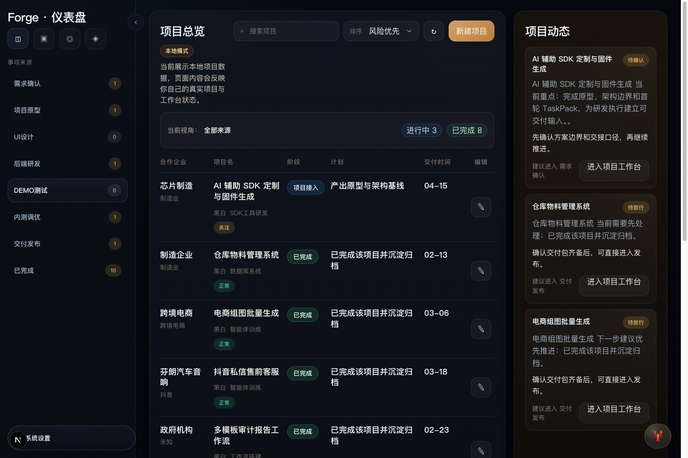
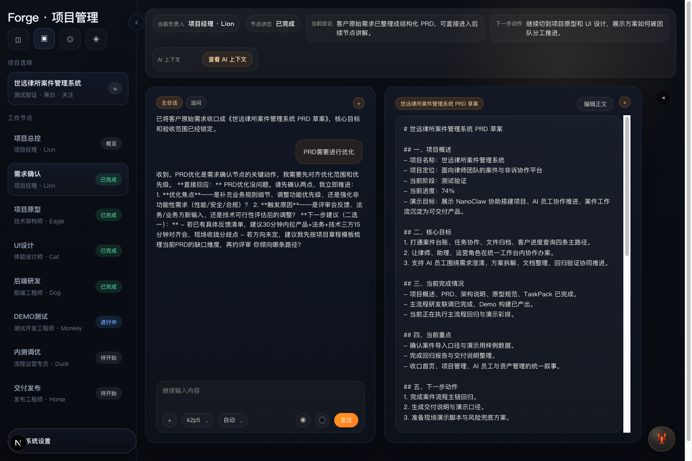
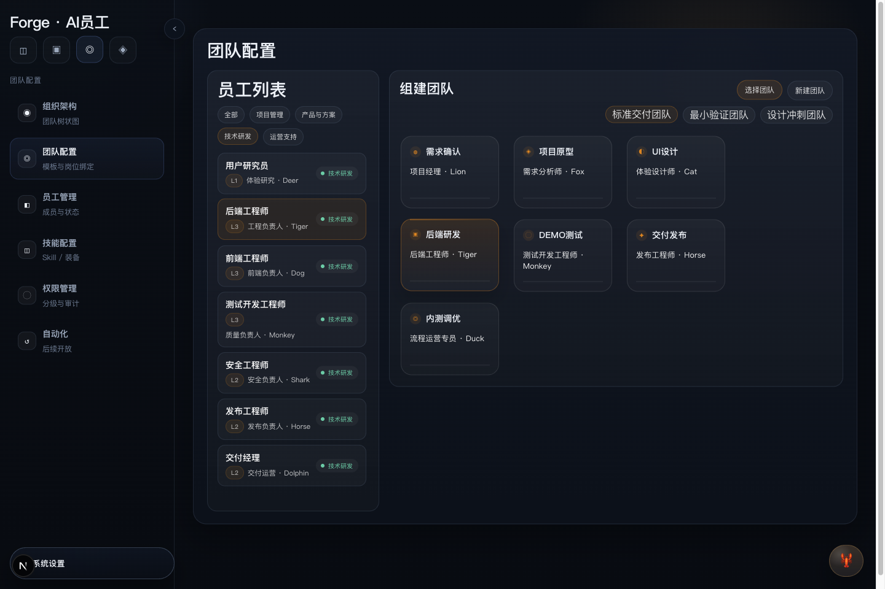
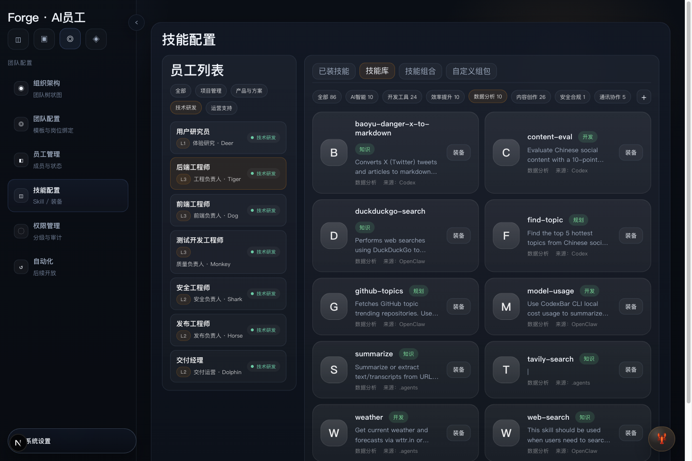

# Forge

> A local-first AI delivery control plane for turning customer requirements into structured execution, evidence, and release workflows.

Forge 是一个面向交付团队的本地优先 AI 工作系统，也可以理解成一个“企业级运作的 AI 团队控制台”。它不把 AI 交付做成一个聊天窗口，而是把项目从需求接入、方案产出、研发执行、测试门禁到交付归档，收成一条可追踪、可审计、可复用的交付链。



它强调的不是“单个 Agent 多聪明”，而是：

- 项目管理中控：多项目并行、风险优先级可视、负责人动作明确
- AI 团队运作：岗位分工、团队模版、节点接棒、专项 AI 员工执行
- 资产与知识沉淀：项目资产归档、经验 SOP、知识库与工作区联动

## 为什么是 Forge

大多数 AI 工具擅长“生成”，但不擅长“交付”。Forge 的目标不是再做一个通用 Agent 编排器，而是做交付控制面：

- 把一句自然语言需求转成正式项目
- 用项目、任务、工件、门禁和运行证据来组织推进
- 让 AI 团队、知识资产和执行后端在同一条链上协作
- 保留本地优先、可离线演示、可审计的工程边界

典型主链：

`需求接入 -> PRD -> TaskPack -> 研发执行 -> 规则审查 -> 测试门禁 -> 交付说明 -> 人工放行 -> 归档沉淀`

## 核心能力

### 1. 项目工作台

- 首页项目总览、项目管理和交付推进视图
- 按节点推进的工作台：项目总控、需求确认、项目原型、UI 设计、后端研发、DEMO 测试、交付发布
- 左侧 AI 对话，中间文档/结果区，右侧工作区文件，适合项目负责人和执行角色协作
- 支持项目级工作区、项目 DNA、模板注入和正式产物沉淀



### 2. Control Plane

- 本地 SQLite 持久化项目、任务、工件、命令执行、门禁和运行证据
- 本地 HTTP API 与 MCP 工具，可供桌面端和外部 Agent 读取统一事实源
- 统一命令链：`prd.generate`、`taskpack.generate`、`execution.start`、`review.run`、`gate.run`、`release.prepare`、`archive.capture`
- 统一整改入口、统一回放入口、统一 release gate 和 evidence timeline

### 3. Runtime Plane

- Runner 注册表与本地 Runner CLI
- 本地 Engineer / Reviewer / QA 执行入口
- 外部执行后端桥接能力，可接 Nano / OpenClaw 一类后端
- 统一的 execution backend prepare / dispatch / execute / bridge / writeback 契约

### 4. 资产与知识

- 组件注册表和装配建议
- 示例知识库与工作区文件浏览
- 工件沉淀类型包括 `prd`、`task-pack`、`ui-spec`、`patch`、`review-report`、`test-report`、`release-brief`、`knowledge-card` 等

## 你会在 Forge 里看到什么

### 项目管理中控

- 首页首先回答“现在有哪些项目、风险在哪里、谁该推进下一步”
- 项目总览和待办区更偏项目负责人视角，而不是单纯的聊天记录
- 适合拿来做多项目并行盯盘和工作汇报

### AI 团队与节点推进

- 每个项目都可以绑定 AI 团队和节点岗位
- 项目经理可以看全局推进，专项 AI 员工则在各自节点产出正式文档和执行结果
- 节点不是一次性生成，而是沿着交付链逐步推进和接棒





### 资产、知识与复用

- 项目资产会按类型沉淀，不只是留在对话里
- 经验、SOP、知识库、工作区文件都可以成为后续项目的复用基础
- 目标是让系统越用越强，而不是每次从零开始

## 适合谁

- 小型 AI 交付团队
- 内部工具团队
- AI 外包团队
- 想把“聊天式推进”升级成“证据驱动交付”的项目负责人

## 快速开始

### 环境要求

- Node.js / npm
- macOS 优先

### 本地启动

```bash
cp .env.example .env.local
npm install
npm run dev
```

默认访问：

- [http://127.0.0.1:3000](http://127.0.0.1:3000)

默认数据模式是示例模式，首次 clone 不需要 Nano、Obsidian、真实技能库，也能直接打开首页和工作台。

### 常用命令

```bash
npm run dev
npm run build
npm run start
npm test
npm run electron:dev
npm run build:electron
npm run mcp:forge
```

Runner 入口：

```bash
npm run runner:forge
npm run runner:engineer
npm run runner:review
npm run runner:qa
```

## 数据模式

Forge 支持两种主要数据模式：

- `demo`：默认示例模式，适合首次体验、演示和开源环境
- `local`：读取你自己的本地数据库

关键环境变量：

- `FORGE_DATA_MODE=demo|local|auto`
- `FORGE_DB_PATH=/absolute/path/to/forge.db`
- `NEXT_PUBLIC_FORGE_DEBUG_WORKSPACE_MAPPINGS=...`

如果你只想体验项目工作台，推荐直接使用 `demo` 模式。

## Nano / 外部执行后端

Forge 自己是控制面，不强制内置一个唯一执行器。你可以把 Nano/OpenClaw 这类执行后端挂在 Runtime Plane 之下。

开源仓库已经预留了这套接入面：

- `FORGE_NANO_EXEC_PROVIDER`
- `FORGE_NANO_EXEC_BACKEND`
- `FORGE_NANO_EXEC_BIN`
- `FORGE_NANO_HEALTHCHECK_COMMAND`
- `FORGE_NANO_MANAGE_COMMAND`

如果这些都没配，Forge 仍然可以以本地示例模式和本地 fallback 方式正常运行。

## 对外接口

### 本地 HTTP API

主要入口包括：

- `GET /api/forge/pages`
- `GET /api/forge/projects`
- `GET /api/forge/tasks`
- `GET /api/forge/remediations`
- `GET /api/forge/control-plane`
- `GET /api/forge/readiness`
- `GET /api/forge/runners`
- `POST /api/forge/commands`
- `POST /api/forge/remediations/retry`
- `POST /api/forge/execution-backends/prepare`
- `POST /api/forge/execution-backends/dispatch`
- `POST /api/forge/execution-backends/execute`
- `POST /api/forge/execution-backends/bridge`
- `POST /api/forge/execution-backends/bridge/writeback`

### MCP

```bash
npm run mcp:forge
```

MCP 会暴露项目、任务、控制面、Runner、工件、执行后端和组件装配相关工具，方便外部 Agent 直接消费 Forge 的控制面事实源。

## 仓库结构

```text
app/        Next.js App Router 页面与 API
src/        前端组件、页面桥接、服务端组装逻辑
packages/   AI、DB、core、model-gateway 等核心包
scripts/    Electron、MCP、Runner、本地后端桥接脚本
config/     运行契约与配置
data/       本地数据库与工作区数据
docs/       计划、发布与开源资料
```

## 当前状态

Forge 目前是一个可运行的公开 alpha：

- 已有完整的本地产品壳、项目工作台和控制面
- 已有 MCP、Runner CLI 和 execution backend bridge
- 已支持开源默认示例模式，无外部依赖也能打开首页
- 已具备公开仓库所需的 LICENSE、CI、贡献与安全文档

当前仍属于早期阶段，以下能力还没有完全产品化：

- 多人协作与云同步
- 更完整的自动组件装配
- 更成熟的 Prompt / Skill 训练闭环
- DMG 签名、公证、自动更新
- 全量真实执行后端接线

## 开源说明

- License: `Apache-2.0`
- Release: [v0.1.0-alpha](https://github.com/233849137-pixel/forge/releases/tag/v0.1.0-alpha)
- 默认建议先用示例模式体验
- 如需恢复本地调试页映射，请显式配置 `NEXT_PUBLIC_FORGE_DEBUG_WORKSPACE_MAPPINGS`

## 贡献与安全

- Contribution guide: [CONTRIBUTING.md](./CONTRIBUTING.md)
- Security policy: [SECURITY.md](./SECURITY.md)
- Changelog: [CHANGELOG.md](./CHANGELOG.md)
- Launch kit: [docs/open-source-launch-kit.md](./docs/open-source-launch-kit.md)

提交 PR 前建议至少运行：

```bash
npm test
npm run build
```
