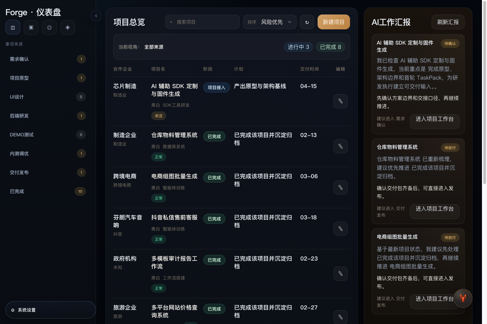

# Forge

Forge 是一个 `macOS-first`、`local-first` 的 AI 研发交付系统。

它可以把外部编排器或执行器挂在 Runtime Plane 之下，但产品本身仍然坚持做 `交付控制面`，而不是另一个通用 Agent 编排器。

它不再把 AI 交付做成单窗口聊天，而是把一条真实研发主链收成可执行、可追踪、可复用的本地交付流水线：

`需求接入 -> PRD -> TaskPack -> 研发执行 -> 规则审查 -> 测试门禁 -> 交付说明 -> 人工放行 -> 归档沉淀`



## 当前定位

- 目标用户：小型交付团队、AI 外包团队、内部工具团队
- 产品目标：把 AI 交付从“聊天式推进”收口成“证据驱动的交付系统”
- 产品形态：单一桌面 App，背后带本地 API、MCP、Runner CLI

## 现在已经做成的部分

### 1. 前台交付工作台

- `工作台 / 项目 / 执行 / 资产 / Agent训练 / 命令中心` 六个一级入口
- 首页聚焦交付主链，不再把团队训练和治理混到前台；当前已经收紧为 `推进判断 / 下一步动作 / 执行快照 / 后台入口 / 推进队列`
- 首页的 `推进判断` 现在也会显式显示 `当前模型执行器`，负责人不需要点进命令中心才能知道当前由谁在跑
- 首页的 `推进判断` 现在也会显式显示 `外部执行准备度`，负责人能直接判断当前是否已经配置真实外部模型执行契约
- 首页的 `推进判断 / 下一步动作` 现在也会显式显示 `外部执行建议 / 接管建议`，负责人可以直接判断当前该继续走本地 fallback，还是沿既有外部执行链推进
- 首页的 `推进判断` 现在也会显式显示 `桥接证据`，负责人可以直接看到外部 execution backend bridge 是否已经写回正式运行时间线
- 首页的 `下一步动作` 现在会优先消费 `qa-handoff` 整改链，bridge-backed review 已移交 QA 时会直接指向测试 Agent 补齐门禁证据
- 首页动作卡的 `support-copy` 现在也会显式显示 `负责人动作`，默认处理动作和命令入口不再分裂
- 首页的 `阻塞与风险` 现在也会显式显示 `当前接棒`，阻塞摘要与默认处理动作开始共享同一条 handoff-aware 接棒链
- 项目有本地工作区、模板注入、项目 DNA、阶段推进和交付就绪度
- 项目页的 `交付就绪度` 现在也会显式显示 `外部执行准备度 / Provider 契约`，交付负责人可以直接判断当前项目是否已经接通真实外部执行链
- 项目页的 `交付就绪度` 现在也会显式显示 `外部执行建议`，负责人可以直接判断当前应先补配置、先产出首条 provider 证据，还是继续沿既有外部执行链推进
- 项目页的 `交付就绪度` 现在也会显式显示 `执行后端 / 后端契约`，负责人视角开始和首页、执行页、治理页共享同一份外部编排后端口径
- 项目页的 `交付就绪度` 现在也会显式显示 `桥接证据 / 桥接明细`，负责人不需要再翻运行时间线确认外部 backend bridge 是否已经落成正式 run evidence
- 项目页的 `交付就绪度` 现在也会显式显示 `桥接移交`，负责人可以直接判断外部 backend bridge 是否已把规则审查推进到 QA 门禁或放行链
- 项目页的 `项目任务清单` 现在也会显式显示每条任务的 `执行后端 / 本地 Runner` 路径，负责人不需要再从整改摘要里猜这条任务默认怎么回放
- 项目页的 `当前上下文` 现在也会显式显示 `默认回放：执行后端 / 本地 Runner`，负责人打开项目页就能知道下一步默认落到哪条执行链
- 项目页的 `当前上下文` 现在也会优先消费 `qa-handoff` 整改链，bridge-backed review 已移交 QA 时不再只显示阶段通用话术
- 项目页的 `阶段准入与缺口` 现在也会显式显示 `当前接棒`，准入判断与负责人动作开始共享同一套 handoff-aware 口径
- 项目页的 `阶段准入与缺口` 现在也会显式显示 `默认回放`，负责人在判断“能否继续推进”时可以同时知道默认会落到哪条执行链
- 资产页优先展示 `装配优先级 / 组件反馈 / 外部候选 / 复用基线`
- 执行页优先展示 `证据状态 / 整改回放 / Runner / 时间线 / 本地上下文`
- 执行页的 `当前执行焦点 / 证据状态` 现在也会显式显示 `模型执行器 / 外部模型执行器`，页面能直接解释当前外部 provider 参与情况
- 执行页的 `整改回放` 现在也会显式显示 `后端命令预览`，执行负责人可以直接看到这次回放将展开成哪条 backend command
- 执行页的 `本地运行上下文` 现在也会显式显示 `外部执行准备度 / Provider 契约`，本地负责人不用再翻环境变量确认 Engineer / Reviewer 是否已接通外部执行链
- 执行页的 `本地运行上下文` 现在也会显式显示 `外部执行建议`，执行负责人可以直接判断当前该继续回放、补首条 provider 证据，还是回退到本地 fallback
- 执行页的 `本地运行上下文` 现在也会显式显示 `桥接证据 / 桥接明细`，执行负责人可以直接确认外部 backend bridge 是否已进入正式运行证据面
- 执行页的 `本地运行上下文` 现在也会显式显示 `桥接移交 / 移交细节`，执行负责人可以直接判断 bridge-backed review 是否已正式移交 QA
- 执行页的 `整改回放` 现在也会直接显示每条整改任务的 `桥接移交 / 移交细节`，执行负责人不需要再跳回放行页确认当前是否已进入 QA handoff
- 治理页的 `放行闸口汇总` 现在也会显式显示 `外部执行准备度 / Provider 契约`，放行判断和命令治理开始共享同一份外部执行配置口径
- 治理页的 `放行闸口汇总 / 风险与阻塞` 现在也会显式显示 `外部执行建议`，整改负责人可以直接看到当前应该补配置、先产出首条 provider 证据，还是沿既有外部执行链回放
- 治理页的 `整改队列` 现在也会显式显示 `后端命令预览`，治理负责人不需要切回 API 或 CLI 才能确认默认 backend command
- 治理页的 `放行闸口汇总 / 风险与阻塞` 现在也会显式显示 `桥接证据 / 桥接明细`，放行与整改负责人可以直接看到外部 backend bridge 的正式写回状态
- 治理页的 `放行闸口汇总 / 自动升级动作 / 风险与阻塞` 现在也会显式显示 `桥接移交`，放行与整改判断开始直接消费 bridge-backed handoff 状态
- 治理页的 `放行闸口汇总` 现在也会显式显示 `当前接棒`，并与首页/项目页复用同一套 bridge-aware 默认动作，不再依赖 escalation 数组顺序
- 治理页的 `风险与阻塞` 现在也会显式显示 `当前接棒`，阻塞摘要与负责人默认动作不再分裂
- 治理页的 `自动升级动作` 现在也会显式显示 `当前接棒`，升级动作与负责人 handoff 开始共享同一套 bridge-aware 责任链
- 治理页的 `待人工确认` 现在也开始复用正式 `approvalTrace`，人工放行不再回退到原始 task 列表
- 治理页的 `升级事项` 现在也开始复用正式 `escalationActions`，升级摘要与结构化放行链不再分叉

### 2. Control Plane

- 项目、任务、工件、门禁、策略判定、命令执行、阶段流转已落到本地 SQLite
- 组件注册表已落到本地 SQLite，快照、AI core 和 HTTP API 现在都能按 `category / sector / sourceType` 查询组件装配建议
- `GET /api/forge/components` 与 `control-plane.componentRegistry` 现在都会返回派生 `usageSignals`，控制面开始能回答“哪个组件最近阻塞过、哪个组件正在执行中”
- `GET /api/forge/capabilities` 现在也会显式返回 `components / totalComponents`，能力注册表和资产层不再脱节
- `GET /api/forge/capabilities` 现在也会显式返回 `executionBackends / executionBackendCount / activeExecutionBackendCount`，执行后端开始成为正式控制面对象，而不只是运行摘要里的文案
- 命令执行会显式回写 `followUpTaskIds`，任务中枢可以直接反查“这个任务由哪个阻断命令生成”
- `GET /api/forge/tasks` 与 MCP `forge_task_list` 现在会一起返回 `sourceCommandLabel / sourceCommandAction`，任务责任链不再只存在于前端页面
- `GET /api/forge/tasks / readiness / remediations / commands` 现在也会显式返回 `taskPackId / taskPackLabel`，控制面和整改回放不再依赖隐式 `latest task-pack`
- `Run` 现在也会正式持久化 `taskPackId / linkedComponentIds`，运行记录不再只是标题和状态
- `GET /api/forge/runs` / `getRunTimelineForAI` 现在会显式返回 `taskPackLabel / linkedComponentLabels`，执行链可以直接回答“这次运行基于哪个 TaskPack、带了哪些装配组件”
- `最近命令执行` 现在也直接吃统一 selector，会显式显示 `相关运行 / TaskPack / 装配组件 / 待装配组件`，治理页和 API 不再各自手工拼这层上下文
- 任务中枢现在还会返回 `relatedArtifactLabels / missingArtifactLabels / evidenceAction`，控制面能直接判断每条任务挂着哪些证据、还缺哪些证据
- 任务中枢现在还能返回 `relatedRunId / relatedRunLabel / runtimeLabel`，控制面开始能回答“是哪次运行把这条任务卡住了”
- 任务中枢现在还会返回 `remediationOwnerLabel / remediationSummary / remediationAction`，控制面开始能直接回答“谁来修、先怎么修”
- 任务中枢现在还会返回 `retryCommandId / retryCommandLabel`，控制面开始能直接回答“修完后该重跑哪个标准命令”
- 任务中枢现在还会返回 `retryRunnerCommand`，控制面和外部 Agent 可以直接拿到本地 Runner 回放入口
- `GET /api/forge/commands` 的最近执行现在也会带 `followUpTasks`，命令中心开始能直接回答“这个阻断命令派生了哪些整改任务、卡在哪些证据”
- `followUpTasks / blockingTasks / remediationQueue` 现在都会带 `unifiedRetryApiPath / unifiedRetryRunnerCommand`，控制面默认以统一 remediation 协议驱动整改回放
- `GET /api/forge/readiness` 与 `GET /api/forge/commands` 现在都会返回 `runtimeSummary`，把 Runner 健康度和版本证据压成统一运行底座摘要
- `GET /api/forge/commands / readiness / remediations` 顶层现在也会直接返回 `currentHandoff / pendingApprovals / escalationItems`，外部 Agent 不需要先展开嵌套 `controlPlane` 才能读取统一治理责任链
- `runtimeSummary` 现在也会返回 `externalExecutionSummary / externalExecutionDetails`，控制面开始能直接解释“是否已配置外部模型执行契约、配置的是哪条契约”
- `runtimeSummary` 现在也会返回 `externalExecutionStatus / externalExecutionContractCount / externalExecutionActiveProviderCount / externalExecutionRecommendation`，调用方不需要再解析中文摘要字符串就能稳定判断当前该走哪条执行链
- `runtimeSummary` 现在也会返回 `executionBackendSummary / executionBackendDetails`，控制面开始能区分“是谁在执行”与“是哪条外部后端在承载执行链”
- `runtimeSummary` 现在也会返回 `bridgeExecutionCount / bridgeExecutionSummary / bridgeExecutionDetails`，控制面与负责人页面可以直接判断外部 backend bridge 是否已经写回正式证据
- `readiness / releaseGate` 现在还会显式返回 `bridgeHandoffStatus / bridgeHandoffSummary / bridgeHandoffDetail`，控制面可以直接判断 bridge-backed review 是否已推进到 `QA handoff / release candidate`
- `release.approve` 在被阻断时现在也会显式消费 `bridgeHandoffStatus`，如果 bridge-backed review 只推进到 `QA handoff`，放行阻断、升级任务和决策摘要都会直接说明“当前已移交 QA 门禁”
- `GET /api/forge/tasks` 与 `GET /api/forge/remediations` 也已接入同一份 `runtimeSummary`，控制面四个主入口不再各自拼 Runner 健康度
- `GET /api/forge/runners` 现在也会返回 `unifiedRemediationApiPath + runtimeSummary`，Runner 注册表不再是控制面里的特殊返回
- `GET /api/forge/snapshot` 现在会同时保留原始快照字段和 `controlPlane` 聚合块，外部 Agent 可一次拿到 `readiness / blockingTasks / remediationQueue / recentExecutions / runtimeSummary`
- `/api/forge/control-plane` 与 `/api/forge/snapshot` 的聚合块现在也会直接返回 `componentRegistry`，外部 Agent 可以同时读取当前项目的组件推荐入口
- `/api/forge/control-plane` 与所有复用 `controlPlane` 聚合块的入口现在也会直接返回结构化 `currentHandoff / pendingApprovals / escalationItems`，外部 Agent 不需要再照着页面文案反推“当前接棒 / 待人工确认 / 升级事项”
- `/api/forge/control-plane` 现在也会在 `remediationQueue / recentExecutions.followUpTasks` 中显式返回 `runtimeExecutionBackendCommandPreview`，外部 Agent 读取控制面快照就能拿到回放用的 backend command 预览
- `/api/forge/tasks / remediations / control-plane` 现在也会显式返回结构化 `runtimeExecutionBackendInvocation`，外部 Agent 不必再从 preview 字符串里反解析 backend 调用上下文
- 已新增 `POST /api/forge/execution-backends/prepare` 与 MCP `forge_execution_backend_prepare`，外部 Agent 现在可以直接按 `taskId / remediationId`，或按已进入 `review-handoff` 的 `projectId` 生成 execution backend adapter request
- 已新增 `POST /api/forge/execution-backends/dispatch` 与 MCP `forge_execution_backend_dispatch`，Forge 现在已经有统一的外部后端发起入口，可返回受控的 dispatch receipt
- 已新增 `POST /api/forge/execution-backends/execute` 与 MCP `forge_execution_backend_execute`，Forge 现在还能把 dispatch 结果推进成标准化 shell execution plan
- 已新增 `POST /api/forge/execution-backends/bridge` 与 MCP `forge_execution_backend_bridge`，Forge 现在已经有显式的受控执行桥；默认返回 stub，显式选择 `local-shell` 时可走本地 shell bridge
- `execution backend bridge` 现在也会直接返回 `outputMode / outputChecks / evidenceStatus / evidenceLabel`，下一批把 bridge 结果回写成正式 run evidence 时不需要再重定义证据协议
- 已新增 `POST /api/forge/execution-backends/bridge/writeback` 与 MCP `forge_execution_backend_bridge_writeback`，Forge 现在已可把 bridge 结果直接落成正式 run evidence，进入现有运行时间线
- bridge writeback 结果现在也会进入 `runtimeSummary`，首页、项目页与 `/api/forge/readiness` 不需要再从 runs 时间线二次归纳这层 bridge 证据
- bridge writeback 成功时现在还会按 backend invocation 的 `expectedArtifacts` 自动落地正式 artifact，占位物开始从外部 backend 执行链直接进入工件面
- review backend bridge 写回成功时现在也会复用标准 review handoff，自动生成 `QA gate` 接棒任务并把项目推进到 `测试验证`
- 当外部研发执行桥已写回 `Patch / Demo`、但尚未进入 `review.run` 时，`currentHandoff` 现在还会直接返回 `runtimeExecutionBackendLabel / runtimeExecutionBackendCommandPreview`，负责人和外部 Agent 不需要再从整改队列反推默认外部执行入口
- `currentHandoff` 在项目级 handoff 下现在还会直接返回结构化 `runtimeExecutionBackendInvocation`，外部 Agent 可以直接把项目当前默认外部执行入口推进到 adapter request / dispatch，而不必再从字符串预览反解析上下文
- 首页、项目页、治理页现在也会在项目级 handoff 下直接显示 `默认外部执行 / 执行入口预览`，负责人第一屏就能看到这一步将落到哪条外部执行后端
- 执行页的 `本地运行上下文` 现在也会在项目级 handoff 下直接显示 `默认外部执行 / 执行入口预览`，四个负责人口径已对齐
- 项目级 `review-handoff` 直连外部 backend 的 `bridge writeback` 现在也会正式写入 `command-review-run` 命令执行记录，命令中心与治理审计不再只看到 run/artifact，而是完整规则审查命令链
- `command_executions` 现在也会显式持久化 `run_id`，项目级外部审查命令与对应 bridge run 已开始一一绑定，命令中心与治理链优先使用这条显式追溯关系
- `readiness / releaseGate / escalationItems` 现在也会显式返回 `bridgeReviewCommandId / bridgeReviewRunId / bridgeReviewRunLabel`，当 bridge-backed review 已移交 QA 时，放行链可以直接追溯“是哪次外部规则审查 run 推进了这次 QA 接棒”
- 整改式 `review.run` bridge writeback 现在也会回写原始 `command-review-run` 的 `relatedRunId`，QA handoff 不再只在项目级直连入口上具备显式 run 审计
- 项目页的 `交付就绪度`、治理页的 `放行闸口汇总 / 放行审批链 / 自动升级动作 / 待人工确认 / 升级事项` 现在也会显式显示 `审查来源运行 / 来源命令`，负责人可以直接看到“这次 QA 接棒来自哪次外部审查运行”
- execution backend 契约现在也已覆盖 QA：可通过 `FORGE_QA_EXEC_COMMAND / FORGE_QA_EXEC_PROVIDER / FORGE_QA_EXEC_BACKEND / FORGE_QA_EXEC_BACKEND_COMMAND` 声明测试门禁后端
- `prepare / dispatch / execute / bridge / bridge-writeback` 现在也支持按 `projectId` 直接消费 `qa-handoff`，外部后端可以从“规则审查已完成、等待测试门禁”直接进入 `gate.run`
- 项目级 `qa-handoff` 直连外部 backend 的 `bridge writeback` 现在也会正式写入 `command-gate-run` 命令执行记录，并自动把 `test-report / playwright-run` 推进到 `release-candidate`
- execution backend 契约现在也已覆盖 Release：可通过 `FORGE_RELEASE_EXEC_COMMAND / FORGE_RELEASE_EXEC_PROVIDER / FORGE_RELEASE_EXEC_BACKEND / FORGE_RELEASE_EXEC_BACKEND_COMMAND` 声明交付说明整理后端
- `prepare / dispatch / execute / bridge / bridge-writeback` 现在也支持按 `projectId` 直接消费 `release-candidate`，外部后端可以从“测试门禁已完成、等待交付说明整理”直接进入 `release.prepare`
- 项目级 `release-candidate` 直连外部 backend 的 `bridge writeback` 现在也会正式写入 `command-release-prepare` 命令执行记录，并自动把项目推进到 `approval` 人工确认链
- execution backend 契约现在也已覆盖 Archive：可通过 `FORGE_ARCHIVE_EXEC_COMMAND / FORGE_ARCHIVE_EXEC_PROVIDER / FORGE_ARCHIVE_EXEC_BACKEND / FORGE_ARCHIVE_EXEC_BACKEND_COMMAND` 声明归档沉淀后端
- `prepare / dispatch / execute / bridge / bridge-writeback` 现在也支持按 `projectId` 直接消费 `归档复用` 阶段，外部后端可以从“人工放行已完成、等待知识沉淀”直接进入 `archive.capture`
- 项目级 `archive.capture` 直连外部 backend 的 `bridge writeback` 现在也会正式写入 `command-archive-capture` 命令执行记录，并自动把 `knowledge-card / release-audit` 写回正式工件面
- `currentHandoff` 在 `归档复用` 阶段现在会优先认领 `task-<projectId>-knowledge-card`，负责人默认接棒不再停留在笼统的归档说明
- `currentHandoff.runtimeExecutionBackendInvocation` 现在也会覆盖归档阶段的知识沉淀接棒，负责人页面与外部 Agent 可直接读取 `archive.capture` 的默认外部执行入口
- `currentHandoff` 在 `归档复用` 阶段现在还会显式返回 `sourceCommandId / sourceCommandLabel / relatedRunId / relatedRunLabel / runtimeLabel`，archive handoff 已能直接追溯“这次知识沉淀接棒来自哪次交付说明整理运行”
- 项目页与治理页现在也会显式显示 `当前接棒来源运行 / 来源命令`，负责人可以直接判断 archive 接棒是由哪次 `release.prepare` 外部执行推进出来的
- 首页与执行页现在也会显式显示 `当前接棒来源运行 / 来源命令`，负责人在第一屏和执行视角下也能直接看到 archive 接棒的来源运行
- 工件页的 `证据时间线` 现在也会按工件类型直接消费 `archive.capture` provenance，`release-audit / knowledge-card` 会显式显示 `来源命令 / 来源运行`，不再错误继承 `review.run` 审计上下文
- `releaseGate` 现在还会显式返回结构化 `archiveProvenance`，并由 `controlPlane / readiness` 顶层直接透传，负责人和外部 Agent 可以直接读取“哪次 `archive.capture` 写回了归档审计，以及它最初来自哪次 `release.prepare`”
- 首页的 `推进判断` 与治理页的 `放行闸口汇总` 现在也会直接显示 `归档接棒 / 归档来源`，负责人第一屏即可判断这次知识沉淀是由哪条 `archive.capture` 写回、又是由哪次 `release.prepare` 推进出来的
- `GET /api/forge/commands` 现在也会在顶层直接返回这份 `archiveProvenance`，命令中心与外部 Agent 不需要先反查 `controlPlane / readiness` 才知道当前归档沉淀来自哪条放行整理链
- 工件页现在也会在第一屏直接显示 `归档接棒 / 归档来源`，负责人不需要先翻 `证据时间线` 才能判断这次 `release-audit / knowledge-card` 来自哪条归档沉淀链
- 工件页现在也会在第一屏直接显示 `正式来源链`，把 `release-brief / review-decision / release-audit / knowledge-card` 的来源命令与来源运行收成统一摘要
- 首页与项目页现在也会直接显示 `正式工件沉淀`，负责人不用切到工件工作台，也能先判断当前是否已经形成正式交付物沉淀；`沉淀清单` 现已退回工件页
- 首页动作卡与项目页当前上下文现在也会直接显示 `当前沉淀：...`，负责人在判断 `当前接棒 / 下一步动作` 时可以同时看到已经沉淀出的正式工件状态
- `formalArtifactCoverage` 现在已经从页面 helper 收成 core selector，并直接进入 `control-plane / readiness / remediations / commands` 顶层；外部 Agent 不需要再自己从页面摘要或 evidence timeline 反推“当前已经沉淀出哪些正式工件”
- `formalArtifactGap` 现在也已经从页面文案收成 core selector，并直接进入 `control-plane / readiness / remediations / commands` 顶层；负责人和外部 Agent 已能直接读取“当前还缺哪些正式工件、由谁补、下一步先做什么”
- `formalArtifactProvenance` 现在也已经从工件页 helper 收成 core selector，`release-brief / review-decision / release-audit / knowledge-card` 的来源命令与来源运行开始有统一事实源
- `formalArtifactResponsibility` 现在也已经从工件页临时文案收成 core selector，并直接进入 `control-plane / readiness / remediations / commands` 顶层；负责人和外部 Agent 已能直接读取“正式工件沉淀 / 缺口 / 待人工确认 / 来源链”
- 首页与项目页现在也会直接显示 `待人工确认 / 确认责任`，并与工件页共用同一份 `formalArtifactResponsibility`，负责人第一屏就能判断“当前有没有真实审批链、由谁确认”
- 治理页的 `待人工确认` 现在也直接消费 `formalArtifactResponsibility.pendingApprovals`；没有真实审批链时会回到空态，不再把未来缺件混进人工确认列表
- `formalArtifactResponsibility` 现在也会直接返回 `approvalHandoff`，把“确认后谁接棒归档沉淀、来源于哪次 release.prepare”收成正式事实源
- `approvalHandoff` 现在也已从 `formalArtifactResponsibility` 前推到 `releaseGate / control-plane / readiness / remediations / commands` 顶层，外部 Agent 与负责人入口不需要再从嵌套责任摘要二次拆“确认后谁接棒”
- 首页、项目页、工件页、治理页现在都能直接显示 `确认后接棒`；负责人不需要再从 `archiveProvenance` 和人工确认条目之间自己拼“审批完成后会交给谁”
- 首页与治理页现在也会直接消费顶层 `approvalHandoff`，显式显示 `接棒细节`，负责人第一屏即可看到“确认后谁接棒，以及这条接棒来自哪次外部执行链”
- 工件页的 `正式工件责任` 现在也会直接显示 `接棒细节`，`首页 / 项目页 / 工件页 / 治理页` 四处现在已经对齐到同一条 `approvalHandoff` 责任链
- 项目页现在也会直接显示 `归档接棒 / 归档来源 / 当前接棒来源运行`，项目负责人主入口已经补齐 `archiveProvenance + currentHandoff provenance`，不再比首页/治理页少一段来源链
- 首页、项目页、工件页、治理页现在也会在第一层显式显示 `接棒动作`；负责人不只知道“确认后交给谁”，还会直接看到“接下来具体要补什么正式工件/沉淀动作”
- `GET /api/forge/commands` 的最近执行与治理页 `最近命令执行` 现在也会直接带 `approvalHandoffSummary / approvalHandoffDetail / approvalHandoffNextAction`；命令审计已经能直接回答“这次 release.prepare 确认后交给谁、接下来要做什么”
- `GET /api/forge/commands` 的最近执行与治理页 `最近命令执行` 现在也会直接带 `releaseClosureSummary / releaseClosureDetail / releaseClosureNextAction`；命令审计已能直接回答“这次 release.prepare 已经收口到哪一步、最终放行还差什么”
- `GET /api/forge/commands` 的最近执行与治理页 `最近命令执行` 现在也会直接带 `archiveProvenanceSummary / archiveProvenanceDetail`；命令审计开始能直接回答“哪次 archive.capture 写回了归档审计，以及它最初来自哪次 release.prepare”
- `archive.capture` 的最近执行现在也会直接带 `releaseClosureSummary / releaseClosureDetail`；命令审计末端已能直接回答“这次归档写回本身就是发布链的最终收口结果”
- 顶层 `releaseClosure` 现在会在 `archive.capture` 写回后进入终态 `archive-recorded`，`control-plane / readiness / commands` 会直接回答“发布链已完成最终放行，归档沉淀已写回正式工件面”
- `release.prepare` 与 `archive.capture` 的命令审计现在会保留分阶段语义：前者继续回答审批链还差什么，后者明确回答最终放行已完成并进入归档沉淀
- 顶层 `releaseClosure` 现在也会直接带 `sourceCommand / relatedRun / runtime`，负责人和外部 Agent 读取 `releaseClosure` 本身就能知道这次最终放行来自哪条外部执行链
- 首页、项目页、治理页现在也会直接显示 `最终放行来源`，负责人不用再并读 `archiveProvenance` 才知道这次最终收口来自哪条命令/运行链
- 工件页 `正式工件责任` 现在也会直接显示 `最终放行来源`，工件工作台第一屏已经和首页 / 项目页 / 治理页对齐到同一条 release closure provenance 口径
- 治理页的 `放行闸口汇总` 现在也会直接显示 `正式工件缺口 / 补齐责任`，负责人在 gate 视角下不需要再切回首页或项目页，也能直接判断“当前还缺哪些正式工件”
- `releaseGate` 现在也会直接携带 `formalArtifactGap`，治理页与 `readiness` 不再各自重复计算 gate 阶段的正式工件缺口
- `formalArtifactGap` 的 `补齐责任` 现在也会按 `review-handoff / qa-handoff / release-candidate` 输出规范化 handoff 口径，避免被任务队列里的临时缺件文案带偏
- `currentHandoff` 现在也开始复用同一套 bridge handoff 规范文案；首页、项目页和外部 Agent 读取到的 `当前接棒` 不再被任务队列里的临时缺件标签带偏
- `releaseGate.escalationActions` 里的正式工件缺失项现在也会直接复用 `formalArtifactGap` 的 owner 与 nextAction；放行升级动作和首页/项目页的负责人动作已开始共享同一条责任文案
- `approvalTrace` 里的 `release-brief / review-decision` 现在也开始在“人工审批前跟随当前 handoff、人工审批后回到 release approval task”两种模式之间切换，放行审批链不再提前跳到“等待归档沉淀”
- 工件页现在也会在第一屏直接显示 `正式工件责任`，把 `正式工件沉淀 / 正式工件缺口 / 补齐责任 / 待人工确认` 收成同一块摘要，不再让负责人自己在工件页和治理页之间拼责任链
- `GET /api/forge/commands` 的最近执行现在也会带 `runtimeEvidenceSummary`，命令中心开始能直接回答“最近是哪条运行链、哪个版本的执行器把命令卡住”
- `GET /api/forge/commands` 的最近执行和 `followUpTasks` 现在也会显式返回 `runtimeModelProviderLabel / runtimeModelExecutionDetail`，命令中心和整改入口不再只靠 `runtimeEvidenceSummary` 猜当前外部执行器
- `GET /api/forge/commands` 的 `followUpTasks.remediationAction` 现在也会自动带上 `模型执行器` 提示，调用方不需要自己再把 provider 字段拼成整改文案
- `GET /api/forge/commands` 现在也会返回 `remediationQueue`，外部 Agent 能直接读取当前最该处理的整改任务列表
- 已新增统一整改入口 `GET /api/forge/remediations` 与 MCP `forge_remediation_entries`，把整改任务和放行升级动作收成同一份控制面事实源
- 已新增统一整改回放入口 `POST /api/forge/remediations/retry` 与 MCP `forge_remediation_retry`，外部 Agent 不再需要自己区分 task / escalation 两条回放链
- 标准命令已经收成正式契约：
  - `prd.generate`
  - `taskpack.generate`
  - `component.assemble`
  - `execution.start`
  - `review.run`
  - `gate.run`
  - `release.prepare`
  - `archive.capture`
- 命令中心可查看：
  - 标准命令
  - Hook / Policy
  - 最近执行
  - 放行闸口汇总
  - 放行审批链
  - 自动升级动作
  - 待人工确认
  - 升级事项

### 3. Runtime Plane

- 已有正式 Runner 注册表：
  - `pm-orchestrator`
  - `architect-runner`
  - `engineer-runner`
  - `reviewer-runner`
  - `qa-runner`
  - `release-runner`
  - `knowledge-runner`
- 已有 Runner 心跳、探测、运行回写、失败归因
- 已有最小 Runtime Adapter 层：
  - `component.assemble -> architect-runner -> forge-architect-runner.mjs`
  - `execution.start -> engineer-runner -> forge-engineer-runner.mjs`
  - `review.run -> reviewer-runner -> forge-review-runner.mjs`
  - `gate.run -> qa-runner -> forge-qa-runner.mjs`
- 命令中心现在会暴露 Runtime Adapter 注册表，Runner CLI 可直接读取执行计划
- 已提供本地 Runner CLI，用于触发标准命令并回写心跳
- Engineer / Reviewer / QA Runner 现在都会显式输出统一证据状态：`contract / tool-ready / executed`
- Runner CLI 在外部执行成功或失败时都会保留这层证据状态到 `runs.outputChecks`，`outputMode` 继续保留兼容
- Engineer / Reviewer 现在已支持 opt-in 的外部模型执行契约：可通过 `FORGE_ENGINEER_EXEC_COMMAND / FORGE_ENGINEER_EXEC_PROVIDER / FORGE_REVIEW_EXEC_COMMAND / FORGE_REVIEW_EXEC_PROVIDER` 注入真实执行入口
- Engineer / Reviewer 现在也支持可选的执行后端标记：可通过 `FORGE_ENGINEER_EXEC_BACKEND / FORGE_REVIEW_EXEC_BACKEND` 显式声明 OpenClaw 这类外部编排后端
- 如果需要把真实执行入口切到外部编排后端，还可通过 `FORGE_ENGINEER_EXEC_BACKEND_COMMAND / FORGE_REVIEW_EXEC_BACKEND_COMMAND` 注入后端命令模板；Runner 会优先走后端命令，再由后端承载具体 provider
- QA 现在也支持同一套外部执行契约：可通过 `FORGE_QA_EXEC_COMMAND / FORGE_QA_EXEC_PROVIDER / FORGE_QA_EXEC_BACKEND / FORGE_QA_EXEC_BACKEND_COMMAND` 注入真实测试门禁后端
- execution backend 契约现在已经收成共享注册表 `config/forge-execution-backend-contracts.json`，Engineer / Reviewer / QA 的 `label / env key / backend command key` 不再散落在脚本和 AI 层里各自维护
- execution backend 注册表现在还会显式描述 `runnerProfile / supportedCommandTypes / expectedArtifacts`，控制面可以直接知道某个后端承载哪条执行链、理论上会产出哪些正式工件
- `controlPlane` 聚合块与 `/api/forge/commands` 现在也会直接返回这份 `executionBackends` 覆盖信息，外部 Agent 不需要再额外调用 capabilities 才知道当前后端覆盖了哪些标准命令链
- `GET /api/forge/readiness` 与 `GET /api/forge/remediations` 顶层现在也会直接返回 `executionBackends`，放行判断与整改回放调用方不需要再从嵌套的 controlPlane 对象里反查
- `getRemediationsForAI()`、`retryTaskForAI()`、`retryRemediationForAI()` 的 `nextAction` 现在会在命中 coverage 时直接提示默认 `执行后端：...`，整改入口会明确说明这次回放默认落到哪条 backend 上
- `GET /api/forge/remediations`、`retryTaskForAI()`、`retryRemediationForAI()` 现在还会返回 `runtimeExecutionBackendCommandPreview`，整改入口不只知道默认 backend，还能直接看到将展开成哪条 backend command
- 控制面聚合块里的 `remediationQueue / recentExecutions.followUpTasks` 现在也会透传 `runtimeExecutionBackendCommandPreview`，执行页、治理页与外部 Agent 已开始共享同一份 backend command preview
- `runtimeExecutionBackendInvocation` 现在会把 `backendId / backend / provider / runnerProfile / commandType / expectedArtifacts / artifactType / taskPackId / linkedComponentIds / commandPreview` 收成同一份结构化 payload，后续接真实 execution backend adapter 不需要再从字符串回推调用参数
- `prepare / dispatch / execute / bridge / bridge-writeback` 这组 execution backend 入口现在也支持按 `projectId` 直接消费 `review-handoff`，外部后端可以从“研发桥已写回 Patch / Demo，等待规则审查”直接进入 `review.run`
- `prepare / dispatch / execute / bridge / bridge-writeback` 这组 execution backend 入口现在也支持按 `projectId` 直接消费 `qa-handoff`，外部后端可以从“规则审查已完成，等待测试门禁”直接进入 `gate.run`
- selector 级 `remediationAction` 现在也会在运行证据已显式携带 `后端 ...` 时直接追加 `执行后端：...`，任务队列、阻断链与最近命令执行的后续任务不再只显示模型执行器
- selector / AI / API 现在还会显式返回结构化字段 `runtimeExecutionBackendLabel`，任务队列、整改入口、最近命令执行与统一回放结果不再需要从文案里反解析默认后端
- 执行页的 `整改回放 / 本地运行上下文` 与治理页的 `最近命令执行 / 自动升级动作` 现在也优先显示结构化 `执行后端`，页面不再依赖长文案去猜默认 backend
- 外部模型执行命中后，会优先走 provider 命令模板，并把 provider 信息以 `model-execution` check 写回运行证据；现有 `codex-ready / review-ready` 模式保持兼容
- 外部模型执行命中且声明执行后端时，`model-execution` check 会继续保留 provider，同时追加 `后端 ...`，控制面可以同时识别执行器与编排后端
- `capabilities` 能力注册表里的 `executionBackends` 现在也会返回 `id / kind / runnerProfile / supportedCommandTypes / expectedArtifacts / commandKey / commandConfigured / commandSource`，控制面可以判断某个后端属于哪条执行链、支持哪些标准命令、应该读取哪条标准调用入口
- `runtimeSummary` 与 `run timeline` 现在也会把外部模型 provider 证据提升成一等字段，控制面可以直接看到 `modelExecutionProviders / modelExecutionDetails`
- `runtimeSummary` 现在还会把外部执行准备度收成结构化状态：`fallback / contracts-ready / provider-active`，首页、治理页和后续自动化都可以直接基于同一份状态给出接管建议
- 首页与治理页现在也会显式显示 `执行后端 / 后端契约`，负责人与治理角色不再把 OpenClaw 一类外部编排器误看成模型 provider
- 已把 Runtime 信号继续接入 `放行审批链 / 自动升级动作 / 交付就绪度 / 证据时间线`，控制面开始能解释“为什么当前可放行或不可放行”
- Reviewer / QA Runner 现在也和 Engineer Runner 使用同一套 `TaskPack + 组件` 协议，执行计划会显式带 `--taskpack-id / --component-ids`
- Reviewer / QA 的 contract summary 现在也会显式写出 `TaskPack` 和 `关联组件`，不再只有 Engineer 链保留这层执行上下文
- `releaseGate.escalationActions` 现在也会带 `runtimeEvidenceLabel`，自动升级动作开始能直接解释“基于哪条运行证据、哪个版本做升级判断”
- `releaseGate.escalationActions` 现在也会带 `taskId / taskLabel / retryRunnerCommand`，自动升级动作不再只是解释风险，也能直接定位责任任务并回放到本地 Runner
- `releaseGate.escalationActions` 现在也会带 `unifiedRetryApiPath / unifiedRetryRunnerCommand`，旧的 `escalations/retry` 仅保留兼容入口
- `releaseGate.escalationActions` 现在也会带 `bridgeHandoffStatus / bridgeHandoffSummary / bridgeHandoffDetail`，升级动作本身已经可以区分 `qa-handoff / release-candidate`
- 当 bridge-backed review 只推进到 `QA handoff` 时，`releaseGate.escalationActions.nextAction` 现在会优先把 `测试报告 / Playwright 回归记录` 指向 `测试 Agent`，不再继续给出泛化的“补齐后重试”
- `GET /api/forge/remediations` 里的 task / escalation 项现在都会显式返回 `bridgeHandoffStatus / bridgeHandoffSummary / bridgeHandoffDetail`，统一整改入口已经能直接消费桥接移交状态
- `GET /api/forge/readiness` 现在还会返回 `runtimeCapabilityDetails`，把版本号和二进制摘要一起带进交付判断
- `runtimeSummary` 与 `run timeline` 现在还会显式返回归一化的证据状态，控制面可以直接区分 `合同模式 / 工具就绪 / 已执行`
- 执行页里的运行卡片现在也会直接显示 `TaskPack`、`装配组件` 和 `Evidence`，运行证据不再只存在于 API
- 已把阻断命令和回流任务显式串起来，项目页、执行页和命令中心都能看到“来源命令 -> 后续任务”的责任链
- `GET /api/forge/tasks`、`GET /api/forge/readiness`、`GET /api/forge/commands` 现在都会共享 `retryRunnerCommand`，整改任务可以直接回放到本地 Runner
- `GET /api/forge/readiness` 现在也会返回 `blockingTasks`，发布判断开始同时携带当前阻断任务链
- `blockingTasks` 现在也会带 `relatedArtifactLabels / missingArtifactLabels / evidenceAction`，发布判断开始同时引用任务证据链
- `blockingTasks` 现在也会带 `remediationOwnerLabel / remediationSummary / remediationAction`，发布判断开始共享整改责任链
- `blockingTasks` 现在也会带 `retryCommandId / retryCommandLabel`，发布判断开始共享整改后的回流入口
- `blockingTasks / remediationQueue` 现在也会带 `runtimeCapabilityDetails`，整改链开始共享版本号和本地执行器证据
- `blockingTasks / remediationQueue / retryTask / retryRemediation` 现在也会带 `runtimeModelProviderLabel / runtimeModelExecutionDetail`，统一回放结果会直接告诉你当前整改将延续哪条外部模型执行链
- `GET /api/forge/remediations` 与统一回放结果现在也会返回 provider 感知的 `nextAction`，整改入口既能给出回放命令，也能直接解释“将由哪个模型执行器接管”
- 命令中心里的 `阻断任务链 / 后续任务` 现在也会直接显示这些运行能力证据，治理后台开始能定位“被哪个版本、哪条执行链卡住”
- 治理页里的 `最近命令执行 / 自动升级动作 / 风险与阻塞` 现在也会显式显示 `模型执行器`，责任人不用再翻运行详情确认由谁接管整改

### 3.5 资产装配层

- 资产页现在已经有 `组件装配入口 + 组件注册表`，会基于当前项目场景推荐登录、支付、上传下载这类通用模块
- 已新增 `GET /api/forge/components`，外部 Agent 可以按场景、分类和来源读取组件装配候选
- 已新增 `GET /api/forge/components/search`，可从 GitHub 拉取外部候选仓库并返回推荐理由
- 已新增 `GET /api/forge/components/assemble` 与 MCP `forge_component_assembly_plan`，外部 Agent 可以直接读取当前项目 / TaskPack 的装配计划
- 已新增 `POST /api/forge/components/assemble` 与 MCP `forge_component_assembly_apply`，可把组件写回项目关联并在资产页显示“已装配组件”
- 资产页现在也会展示 `组件使用信号`，基于真实 `runs.linkedComponentIds + runEvents` 派生最近阻塞、执行中、已验证等反馈
- 资产页现在也会展示 `外部候选资源`，把本地组件装配建议和 GitHub 候选资源并排展示
- `component.assemble` 现在已经是正式标准命令，组件装配不再是旁路 API，而是能通过命令中心和 `executeCommand` 主入口直接执行
- `taskpack.generate` 现在会把组件装配回流任务显式写进 `followUpTaskIds`，装配缺口不会再只藏在任务摘要里
- `component-assembly` 任务现在会优先回放 `command-component-assemble`，整改链不再退回旧来源命令
- `retryTask / retryRemediation / runner:forge --task-id` 在组件装配任务上会优先透传待装配组件，而不是误用已装配组件
- `GET /api/forge/components` 现在也支持 `projectId`，会自动按项目场景返回推荐组件
- 组件推荐现在还会显式绑定 `taskPackId`，优先根据当前 TaskPack 标题和关键词给出装配建议
- `taskpack.generate` 现在会自动挂接首批推荐组件，减少每个项目从零装配的起盘动作
- Engineer Runtime Plan 现在会显式携带 `--component-ids`，装配结果已经开始影响研发执行语义
- `control-plane` 与资产页现在都会带 `TaskPack 装配建议`，负责人和外部 Agent 能直接看到“为什么推荐这个组件”
- `execution.start` 现在会把 `待装配组件` 当成正式前置条件；如果当前 TaskPack 还没挂任何已装配组件，会先阻断研发执行并回流到组件装配任务
- 当前阶段仍停留在“可查询、可推荐”，还没有进入自动拼装

### 4. Evidence Plane

所有交付推进都在往证据对象收口，目前已经支持：

- `prd`
- `architecture-note`
- `ui-spec`
- `task-pack`
- `patch`
- `review-report`
- `demo-build`
- `test-report`
- `playwright-run`
- `review-decision`
- `release-brief`
- `release-audit`
- `knowledge-card`

没有证据，不允许推进阶段。

## 当前已经跑通的主链

当前系统已经能把以下命令联成一条完整主链：

1. `生成 PRD`
2. `生成 TaskPack`
3. `启动研发执行`
4. `发起规则审查`
5. `发起测试门禁`
6. `整理交付说明`
7. `确认交付放行`
8. `触发归档沉淀`

每一步都会联动：

- 工件状态
- 任务状态
- Runner 状态
- 评审记录
- 阶段阻塞
- 放行闸口
- 后续回流任务

## 仍然没完成的部分

Forge 现在已经不是概念 Demo，但还没有到“完整生产系统”。

还没接通的关键项：

- 真实 Codex / Claude / Playwright 执行链
  - 当前 Runner CLI 已经真实存在
  - 当前三条核心命令已经先走 Runtime Adapter
  - Engineer / Reviewer 已有 opt-in 外部执行契约，但默认仍保持本地 fallback，不会自动切到真实模型
  - 真实 provider 证据仍以 `outputChecks.model-execution` 作为事实源，但 `runtimeSummary / run timeline / control-plane` 已能直接返回结构化 provider 视图
  - 执行后端目前仍停留在“声明与透传”阶段，还没有做成真正的 OpenClaw / 第三方编排后端适配器
- 组件装配系统
  - 已有本地组件注册表、GitHub 候选搜索、装配入口和派生使用信号
  - 还没有组件自动选型、自动拉取和模块拼装
- 资产反馈模型
  - 第一版已用运行链派生 `usageSignals`
  - 还没有持久化评分模型和跨项目效果回写
- Prompt / Skill 训练闭环
  - 已有注册表和绑定关系
  - 但还没有版本评估、效果对比、训练反馈飞轮
- 多人协作与云同步
- DMG 打包、签名、公证、自动更新

## 快速启动

```bash
npm install
npm test
npm run build
npm run build:electron
npm run electron:dev
```

本地服务默认跑在：

- [http://127.0.0.1:3000](http://127.0.0.1:3000)

## 对外接口

### 1. 本地 HTTP API

Forge 提供本地 API，供桌面端和外部 Agent 调用：

- `GET /api/forge/commands`
- `GET /api/forge/components`
- `GET /api/forge/components/search`
- `POST /api/forge/commands`
- `GET /api/forge/projects`
- `GET /api/forge/tasks`
- `POST /api/forge/tasks/retry`
- `GET /api/forge/remediations`
- `POST /api/forge/remediations/retry`
- `POST /api/forge/execution-backends/prepare`
- `POST /api/forge/execution-backends/dispatch`
- `POST /api/forge/execution-backends/execute`
- `POST /api/forge/execution-backends/bridge`
- `POST /api/forge/execution-backends/bridge/writeback`
- `GET /api/forge/control-plane`
- `GET /api/forge/runners`
- `POST /api/forge/runners`
- `GET /api/forge/readiness`
  - 返回 `readiness / blockingTasks / releaseGate / evidenceTimeline`
  - `readiness` 内含 `runtimeNotes` 与 `runtimeCapabilityDetails`

### 2. MCP

启动 Forge MCP：

```bash
npm run mcp:forge
```

当前已暴露的工具包括：

- `forge_command_center`
- `forge_command_execute`
- `forge_project_list`
- `forge_project_snapshot`
- `forge_control_plane_snapshot`
- `forge_delivery_readiness`
- `forge_remediation_entries`
- `forge_remediation_retry`
- `forge_execution_backend_prepare`
- `forge_execution_backend_dispatch`
- `forge_execution_backend_execute`
- `forge_execution_backend_bridge`
- `forge_execution_backend_bridge_writeback`
- `forge_task_list`
- `forge_task_retry`
- `forge_runner_registry`
- `forge_runner_probe`
- `forge_runner_heartbeat`
- `forge_run_upsert`
- `forge_run_timeline`
- `forge_component_registry`
- `forge_component_resource_search`

其中 `/api/forge/control-plane` 与 `forge_control_plane_snapshot` 会直接返回统一控制面聚合块，外部 Agent 可以一次拿到：

- `runtimeSummary`
- `readiness`
- `releaseGate`
- `blockingTasks`
- `remediationQueue`
- `evidenceTimeline`
- `recentExecutions`
- `componentRegistry`

不再需要自己 round-trip 多个 MCP 工具再做拼接。

其中 `GET /api/forge/components` 与 `forge_component_registry` 现在都支持：

- `projectId`
- `taskPackId`
- `query`
- `category`
- `sector`
- `sourceType`

其中 `GET /api/forge/components/search` 与 `forge_component_resource_search` 现在都支持：

- `projectId`
- `taskPackId`
- `query`
- `tags`
- `category`
- `language`
- `maturity`
- `maxItems`

其中 `POST /api/forge/tasks/retry` 与 `forge_task_retry` 现在都会返回：

- `retryRunnerArgs`
- `retryRunnerCommand`

外部 Agent 可以直接把整改任务回放到本地 Runner，而不必自己再拼命令。

如果你希望不区分普通整改任务还是放行升级动作，也可以直接走统一入口：

- `POST /api/forge/remediations/retry`
- `forge_remediation_retry`

它们会自动识别整改条目类型，并回放到正确的来源命令。

如果你希望把某条整改直接交给外部 execution backend，也可以先生成标准 adapter request：

- `POST /api/forge/execution-backends/prepare`
- `forge_execution_backend_prepare`

现在这条入口除了支持 `taskId / remediationId`，也支持对已进入 `review-handoff` 的项目直接传 `projectId`。这样当外部研发桥已经写回 `Patch / Demo` 时，外部后端可以不经过手工补 task，直接准备 `review.run` 的 adapter request。

它们会按 `remediationId` 或 `taskId` 返回统一的 `runtimeExecutionBackendInvocation`，后续接 OpenClaw 一类外部编排后端时不需要再自己拼 TaskPack、组件和命令上下文。

如果你希望进一步走到“统一发起”这一步，也可以直接调用：

- `POST /api/forge/execution-backends/dispatch`
- `forge_execution_backend_dispatch`

当前它会返回 stub 模式的 dispatch receipt，先把 `source / backend / provider / invocation / dispatchedAt` 收成统一事实源；后续接真实外部编排后端时，可以在这个入口后面替换成真正的 adapter 执行。

如果你希望外部执行器直接消费一份标准化 shell plan，也可以调用：

- `POST /api/forge/execution-backends/execute`
- `forge_execution_backend_execute`

当前它会返回 `mode: external-shell-stub` 的 execution plan，显式给出 `cwd / command / commandPreview`。这样后续接真实 OpenClaw 执行桥时，只需要替换 execute 入口背后的执行器，不需要重做 prepare 和 dispatch 边界。

如果你希望先通过 Forge 的受控桥接层实际触发一次外部 shell 执行，也可以调用：

- `POST /api/forge/execution-backends/bridge`
- `forge_execution_backend_bridge`

当前它默认返回 `mode: external-shell-bridge-stub` 的 bridge 结果；当显式传入 `strategy: "local-shell"` 时，会在本地执行 `execute` 生成的 shell plan，并返回统一的 `executionResult`。这样后续接真实 OpenClaw / 第三方编排器时，只需要替换 bridge 背后的执行策略，不需要重做 prepare / dispatch / execute 三段契约。

bridge 返回里现在还会直接带上标准化 `outputMode / outputChecks / evidenceStatus / evidenceLabel`，与现有 Runner / Run 证据结构保持一致；后续如果要把 bridge 执行结果回写成正式 run evidence，只需要接线，不需要再补协议。

如果你希望不只是拿到 bridge 返回，而是把它直接写进 Forge 的运行时间线，也可以调用：

- `POST /api/forge/execution-backends/bridge/writeback`
- `forge_execution_backend_bridge_writeback`

它会复用 bridge 返回的 `outputMode / outputChecks / evidenceStatus / evidenceLabel`，并通过现有 `runs` 证据结构把结果落成正式 run。这样控制面、运行时间线和后续门禁/整改分析都能直接读取这条外部 backend 执行证据。

### 3. Runner CLI

启动本地 Runner 命令：

```bash
npm run runner:forge -- --command-id command-review-run --project-id retail-support
```

如果你是从整改任务直接回放，也可以不再手工传 `command-id`：

```bash
npm run runner:forge -- --task-id task-retail-playwright --project-id retail-support
npm run runner:forge -- --remediation-id task-retail-playwright --project-id retail-support
```

如果要显式把整改链绑定到来源 TaskPack，Runner 现在也支持：

```bash
npm run runner:forge -- --task-id task-retail-playwright --project-id retail-support --taskpack-id artifact-taskpack-retail
npm run runner:forge -- --remediation-id task-retail-playwright --project-id retail-support --taskpack-id artifact-taskpack-retail
```

如果你要显式指定执行器，也可以：

```bash
npm run runner:forge -- --runner-id runner-reviewer --command-id command-review-run --project-id retail-support
```

也可以直接调用岗位本地执行器：

```bash
npm run runner:engineer -- --project-id retail-support --workspace /path/to/workspace --taskpack latest
npm run runner:review -- --project-id retail-support --workspace /path/to/workspace --artifact patch
npm run runner:qa -- --project-id retail-support --workspace /path/to/workspace
```

如果你要让 Runner 真正执行 Runtime Adapter 计划，而不是只走 Forge 内部编排，可以加：

```bash
npm run runner:forge -- --command-id command-gate-run --project-id retail-support --execute-plan
```

Runner CLI 现在会：

1. 先读取命令契约和 Runner 注册表，自动选择匹配的本地执行器
2. 读取 Runtime Adapter 执行计划，并为工程链自动解析当前项目的 `taskpack-id`
3. 创建正式 `run` 记录
4. 回写 `busy` 心跳
5. 调用 Forge 命令执行入口，或在传入 `--task-id` 时直接回放整改任务
6. 回写 `done / blocked` 的运行结果与最终心跳

如果本地 API 没有启动，Runner 会明确提示先启动桌面端或 `npm run dev`，不再只报 `fetch failed`。

当传入 `--execute-plan` 时，Runner 会尝试真正执行本地 shell 计划；如果二进制不存在或执行失败，会把结果回写成阻塞。
执行成功时，Runner 还会把本地执行器返回的 `mode / checks / summary` 一并带回，方便上层判断当前链路是 `contract-*` 还是 `*-ready`。
这些 runtime notes 也会继续透传进 Forge 命令执行摘要，因此即使门禁被阻塞，审计里也能看到当时的本地执行能力状态。
现在 `checks` 里的 `summary` 也会继续透传进运行遥测和执行页，因此控制面可以直接看到本机检测到的二进制路径与版本摘要，而不只是一句 `pass/fail`。
整改链现在也会显式透传 `taskPackId`，所以 `task retry / remediation retry / runner:forge --task-id` 都会回放到来源 TaskPack，而不是退回模糊的 `latest` 选择。
当外部研发执行桥已把 `Patch / Demo` 写回、但尚未进入规则审查时，Forge 现在会把这段中间态明确收成 `review-handoff`，负责人视角会直接提示“先由架构师 Agent 发起规则审查并补齐规则审查记录”，不再只显示笼统的 `bridge-evidence`。
首页现在也会显式显示 `桥接移交 / 移交细节`，负责人在第一屏就能看到外部桥接结果已经推进到 `review-handoff / qa-handoff / release-candidate` 的哪一棒。
治理页的 `放行闸口汇总 / 自动升级动作` 现在也会把 `review-handoff` 收成正式升级项：当桥接研发执行已完成但规则审查尚未开始时，系统会直接给出 `规则审查记录 · 待形成`，并把默认接棒收口到 `架构师 Agent -> 发起规则审查`。
当项目级 `release.prepare` 外部桥接已经写回交付说明和放行评审草稿后，`currentHandoff` 现在会优先提升到 `approval`，负责人默认接棒会直接切到 `确认交付说明与放行口径`，不再继续停留在 `release-candidate`。

其中 Engineer 链已经不再直接暴露裸 `codex exec`，而是先走 Forge 自己的 `scripts/forge-engineer-runner.mjs` 本地入口，并显式绑定到当前项目的 `taskpack-id`。
Engineer 本地执行器现在也支持 `--execute-if-ready`：检测到本机 Codex 后会优先执行真实本地命令；否则保持 `codex-ready / contract-execution` 安全回退。

其中 Reviewer 链已经不再依赖不存在的裸 `forge-review`，而是先走 Forge 自己的 `scripts/forge-review-runner.mjs` 本地入口。
Reviewer 本地执行器现在也支持 `--execute-if-ready`：检测到本机 git 后会优先执行真实本地审查命令；否则保持 `review-ready / contract-review` 安全回退。

其中 QA 链已经不再直接依赖裸 `playwright test`，而是先走 Forge 自己的 `scripts/forge-qa-runner.mjs` 本地入口，后续再在这个入口下接真实 Playwright。
QA 本地执行器现在已经支持 `--execute-if-ready`：当工作区存在 Playwright 配置或 `test:e2e` 脚本时，会优先执行真实本地门禁；找不到可执行配置时则保持 `playwright-ready` 就绪态，不会硬失败。
QA 本地执行器现在也会显式输出 `evidenceStatus / evidenceLabel / executedCommand`，门禁链不再退回只有 `mode` 字符串的旧口径。

当前三个本地执行器都会先做最小能力探测：

- Engineer：检测本机 `codex`，命中后进入 `codex-ready`
- Reviewer：检测本机 `git`，命中后进入 `review-ready`
- QA：检测本地 `playwright`，命中后进入 `playwright-ready`

这条链已经是“真实本地执行入口”，但执行内容本身目前仍以 Forge 内部编排为主。

## 当前架构

### Control Plane

- 项目
- TaskPack
- 工件
- 门禁
- 审计
- 命令中心

### Runtime Plane

- Runner Profiles
- Skill / Hook / Rule 基线
- MCP Profiles
- 本地 Runner
- Opt-in 外部模型执行契约
- 外部执行契约准备度摘要

### Evidence Plane

- Patch
- Test Report
- Playwright Run
- Review Decision
- Release Brief
- Release Audit
- Knowledge Card

## 最近收口

- 首页与项目页已经进入 UI 信息架构重构阶段：不再把 `状态 / 责任 / 证据 / 动作` 堆在一张长清单里，而是重组为 `当前态势 / 责任链 / 证据与风险` 与 `项目总览 / 推进与接棒 / 放行与缺口`。
- `SummaryGroup`、`getResolvedFormalArtifactResponsibilityView(...)`、`getResolvedReleaseClosureView(...)` 现在共同构成首页/项目页新的前台摘要层；后端事实源冻结不动，页面只重排 operator-facing 信息。
- 首页与项目页的结构回归测试已经更新到新 IA，旧的 `推进判断 / 当前上下文 / 阶段准入与缺口 / 交付就绪度` 标题不再作为前台主入口。
- 项目页 `交付就绪度` 现在也会直接显示 `最终放行摘要 / 放行细节 / 放行动作`，项目负责人入口不再只看到 `approvalHandoff / archiveProvenance` 的拆分片段。
- 工件页 `正式工件责任` 现在也会直接显示 `最终放行摘要 / 放行细节 / 放行动作`，工件工作台第一屏已经能直接回答“当前发布链收口到哪一步”。
- `GET /api/forge/commands` 的最近执行与治理页 `最近命令执行` 现在也会直接显示 `最终放行摘要 / 放行细节 / 放行动作`，命令审计已经能回答“这次 release.prepare 还差哪一步最终放行”。
- `archive.capture` 的最近执行现在也会直接显示 `最终放行摘要 / 放行细节`，命令审计末端已经能回答“这次归档写回本身就是哪条最终放行链的收口结果”。
- 顶层 `最终放行摘要` 现在会在归档写回后进入终态 `archive-recorded`，首页/项目页/工件页/治理页看到的是“发布链已完成最终放行，归档沉淀已写回正式工件面”，而 `release.prepare` 的命令审计仍保留审批前语义。
- 顶层 `最终放行摘要` 现在也会带 `最终放行来源`，首页/项目页/治理页已经能直接显示这次最终收口来自哪条外部执行命令与哪次运行。
- 首页与治理页现在也会直接显示 `最终放行责任链`，把 `最终放行摘要 / 当前动作 / 确认后接棒 / 归档接棒 / 最终放行来源` 收成一行，负责人第一屏就能看到发布链如何收口。
- `releaseClosureResponsibility` 现在也已经从页面 helper 收成 core selector，并直接进入 `releaseGate / control-plane / readiness / remediations / commands` 顶层；首页与治理页优先直接消费这份事实源，不再各自拼 `approvalHandoff + archiveProvenance + releaseClosure`。
- 项目页 `交付就绪度` 与工件页 `正式工件责任` 现在也都会直接显示 `最终放行责任链`，四个负责人入口对最终放行责任链已经统一到同一份顶层事实源。
- 首页与治理页现在在没有拆分 `releaseClosureDetail / source / nextAction` 时，也能直接用顶层 `releaseClosureResponsibility.detail / sourceLabel / nextAction` 渲染 `放行细节 / 最终放行来源 / 放行动作`，最终放行责任链已经开始从“单行摘要”升级成结构化事实源消费。
- 首页与治理页现在在没有旧的 `releaseClosureSummary` 时，也会直接按 `releaseClosureResponsibility` 渲染整块 `最终放行摘要 / 责任链 / 放行细节 / 最终放行来源 / 放行动作`，最终放行摘要块已经真正切换到结构化责任链驱动。
- `GET /api/forge/commands` 的最近执行与治理页 `最近命令执行` 现在也会直接显示 `最终放行责任链`，并且 `release.prepare / archive.capture` 的命令审计都会携带同一份 `releaseClosureResponsibilitySummary`，命令中心已经能直接回答“这次命令执行处在最终放行链的哪一段”。
- `GET /api/forge/commands` 的最近执行与治理页 `最近命令执行` 现在也会直接显示 `放行细节 / 放行动作 / 最终放行来源`，并优先消费结构化的 `releaseClosureResponsibility.detail / nextAction / sourceLabel`，命令审计末端已经能直接回答“这次命令执行为什么卡住、下一步谁接棒、来源于哪条外部执行链”。
- 项目页 `交付就绪度` 现在也会直接消费顶层 `releaseClosureResponsibility.detail / sourceLabel / nextAction`；即使不再透传旧的 `releaseClosureSummary / detail / nextAction`，也能完整渲染 `最终放行摘要 / 责任链 / 放行细节 / 最终放行来源 / 放行动作`。
- 工件页 `正式工件责任` 现在也会在 archive 终态直接显示 `放行动作`，并优先消费 `releaseClosureResponsibility.detail / nextAction / sourceLabel`，工件工作台与首页 / 项目页 / 治理页的最终放行口径已经继续收平。
- 首页、项目页、治理页、工件页现在都统一通过 `getResolvedReleaseClosureView(...)` 优先消费结构化的 `releaseClosureResponsibility.*`，即使同时存在 legacy `releaseClosureSummary` 也不会再回退成旧口径。
- 治理页与工件页的 `最终放行摘要 / 责任链 / 放行细节 / 最终放行来源 / 放行动作` 现在也已经切到同一套 helper，页面级最终放行摘要优先级已在四个负责人入口上收平。
- 首页、项目页、治理页、工件页现在也统一通过 `getResolvedFormalArtifactResponsibilityView(...)` 解析 `正式工件沉淀 / 缺口 / 待人工确认 / 确认后接棒`，`approvalHandoff*` 的显式传入值会稳定覆盖 snapshot 默认值。
- 首页、项目页、治理页、工件页现在也统一通过 `getFormalArtifactResponsibilitySummaryItems(...)` 生成 `正式工件责任` 清单项，`沉淀 / 缺口 / 待人工确认 / 确认后接棒 / 最终放行责任链` 的展示顺序和默认文案已共享，不再各页各自拼装。
- 首页与项目页现在也统一通过共享 `OverviewSignalCluster` 渲染双栏总览区，`项目态势 / 运行链` 与 `当前项目 / 执行入口` 不再继续手工拼 `SummaryCluster + SummaryGroup`。
- 项目页现在也切到 `主工作区 + 右侧操作轨` 壳层，`项目推进轨道 / 项目态势 / 责任与放行` 与 `任务与起盘 / 阶段状态` 开始分轨显示，不再像一堵同权重 panel 墙。
- 工件页 `工件总览` 与治理页 `治理基线` 现在也统一通过共享 `GroupedSummaryCluster` 渲染纵向摘要堆，`待接棒队列 / 关键缺失工件` 与 `标准命令 / 策略 Hook / 策略判定` 不再继续手工拼 `SummaryCluster + SummaryGroup`。
- `ForgeChrome` 已切到更接近 admin shell 的 `品牌导航 + 侧栏信号卡 + 顶部上下文条 + 内容区` 壳层；首页也已切成 `主工作区 + 右侧操作轨`，不再把所有主块平铺成同权重卡片墙。
- 首页、项目页、治理页、工件页现在在没有真实审批链时，不再展示空的 `待人工确认 / 确认责任 / 确认后接棒` 行；负责人默认先看 `沉淀 / 缺口 / 补齐责任`，有真实审批链时才展开确认责任。
- 首页、项目页第一屏现在不再展开 `沉淀清单`；详细沉淀明细只留在工件页，首页和项目页只回答“沉淀到了什么 / 还缺什么 / 谁来补”。
- 共享 `SummaryGroup / SummaryList` 现在切到编辑部式摘要卡样式，四个负责人入口不再只是普通列表卡，视觉层级开始跟 `交付控制台` 定位对齐。
- `ForgeChrome` 现在切到 `品牌区 / 模块导航 / hero 标题区 / 信号卡` 壳层，导航与标题区不再只是默认侧栏和标题条，整体气质开始接近编辑部式交付控制台。
- 共享 `SectionPanel` 现在是带标题的具名 region，`panel` 与 `workflow-rail` 也切到更清晰的壳层层级，页面大块结构不再都像同一种卡片。
- `SummaryGroup` 现在已经有 `signal / closure / provenance` 共享 tone system，`当前接棒 / 最终放行责任链 / 归档来源链` 已不再长成同一种摘要卡。
- 首页、项目页、工件页现在都把 `最终放行责任链` 从 `正式工件责任` 里拆成了独立分组，负责人第一屏不再需要在同一块列表里混读“工件缺口”和“放行终态”。
- 首页、项目页、治理页、工件页现在也开始统一通过共享 helper 解析 `正式工件责任 / 最终放行责任链`，展示层剩余的优先级判断进一步减少。
- 首页、项目页、工件页现在开始统一通过共享 `ResponsibilitySummaryCluster` 组织 `当前接棒 / 正式工件责任 / 最终放行责任链 / 归档接棒 / 正式来源链`，责任区不再每页各自拼三四个 `SummaryGroup`。
- 首页、项目页、治理页、工件页现在也开始统一通过共享 `getResolvedFormalArtifactResponsibilityView(...)`、`getResolvedReleaseClosureView(...)` 与 `getFormalArtifactResponsibilitySummaryItems(...)`、`getReleaseClosureSummaryItems(...)` 组合责任链，展示层判断继续减少。
- 治理页 `责任与升级` 现在也统一通过共享 `GovernanceResponsibilityCluster` 组织 `放行审批链 / 自动升级动作 / 风险与阻塞 / 待人工确认 / 升级事项`，治理页责任区不再手工堆五块 `SummaryGroup`。
- 工件页 `证据与评审` 与治理页 `命令审计` 现在也统一通过共享 `EvidenceAuditCluster` 组织 `证据时间线 / 评审结果记录 / 通过条件` 与 `最近流转记录 / 最近命令执行`，证据区与审计区不再手工堆叠摘要块。
- 首页 `动作与执行` 与项目页 `任务与起盘` 现在也开始统一通过共享 `WorkbenchPanelCluster` 承载工作区卡片，不再每页手工写一层 `summary-card-grid` 壳。
- 治理页现在已切到 `放行判断 / 责任与升级 / 命令审计` 三段，`放行闸口汇总 / 放行审批链 / 自动升级动作 / 风险与阻塞 / 待人工确认 / 升级事项 / 最近命令执行` 都降为同页分组，负责人不再面对碎片化 panel 墙。
- 工件页现在已切到 `工件总览 / 责任与来源 / 证据与评审` 三段，顶层先回答当前工件状态，再回答责任来源，最后再展开证据与评审。
- `SummaryGroup` 现在已经成为首页 / 项目页 / 治理页 / 工件页共同的 operator-facing 分组层；当前批次继续冻结后端事实源，只重排负责人视角的信息架构。
- 治理页 `放行判断` 现在已拆成 `闸口判断 / 执行链信号 / 最终放行责任链` 三层，原来的超长 `放行闸口汇总` 已退场，放行结论和执行链状态开始分层显示。
- 治理页下半区现在进一步收成 `治理基线`，`标准命令 / 策略 Hook / 策略判定 / 协作规则` 不再四块平铺。
- 工件页下半区现在进一步收成 `工件资产`，`当前工件清单 / 最新 PRD 草案` 不再拆成两个顶层块。

## 当前验证状态

常用验证命令：

```bash
npm test
npm run build
npm run build:electron
node --check scripts/forge-mcp.mjs
```

## 已知问题

- 已切换到 `better-sqlite3`，本地数据库驱动不再依赖 Node 内置实验特性
- 当前 Runner 是“真实入口 + 半模拟执行”
- README 与产品实现现在已基本同步，但外部产品文案仍需要继续压缩成更清晰的对外版本

## Open Source Notes

- License: `Apache-2.0`
- 默认启动建议使用示例模式；未显式配置本地数据路径时，仓库应优先面向开源演示体验
- 如果需要切到你自己的本地数据库，请显式配置 `FORGE_DB_PATH` 或 `FORGE_DATA_MODE=local`
- 如果需要给某个本地工作区恢复“打开调试页”入口，请显式配置 `NEXT_PUBLIC_FORGE_DEBUG_WORKSPACE_MAPPINGS`，不要把个人 `localhost` 调试映射硬编码进仓库

### Quick Start

```bash
cp .env.example .env.local
npm install
npm run dev
```

- 默认 `FORGE_DATA_MODE=demo`，首次启动会直接进入示例模式
- 如果你要切到自己的本地数据库，请在 `.env.local` 里配置 `FORGE_DATA_MODE=local` 或 `FORGE_DB_PATH`
- 如果你暂时没有配置 Nano、Obsidian、真实技能库，本仓库首页和示例工作台也能正常打开

## Contributing and Security

- Contribution guide: [CONTRIBUTING.md](./CONTRIBUTING.md)
- Security policy: [SECURITY.md](./SECURITY.md)
- Launch kit: [docs/open-source-launch-kit.md](./docs/open-source-launch-kit.md)
- Changelog: [CHANGELOG.md](./CHANGELOG.md)
- Pull requests should pass `npm test` and `npm run build`
